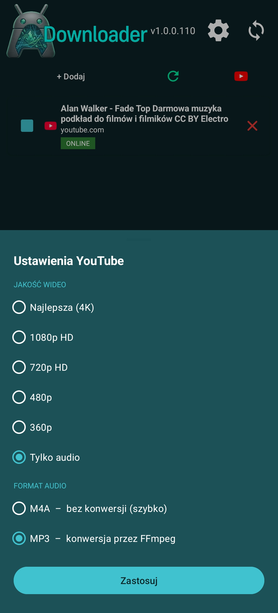
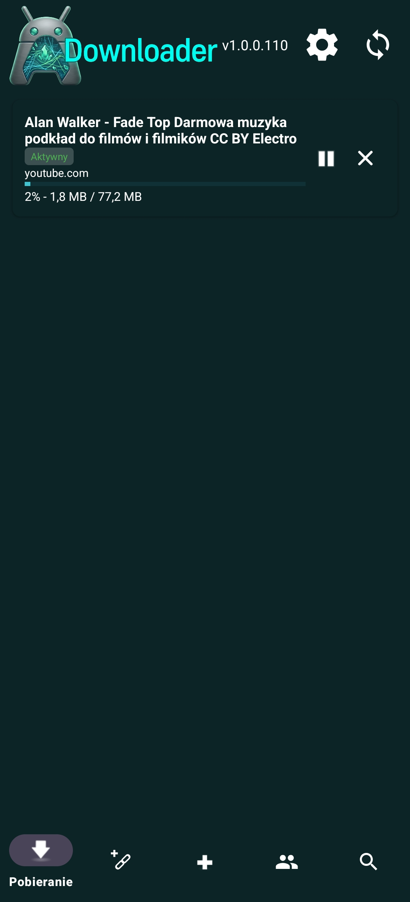
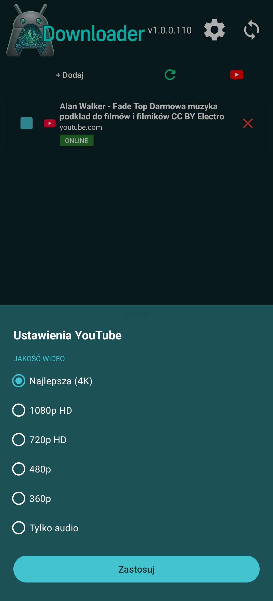
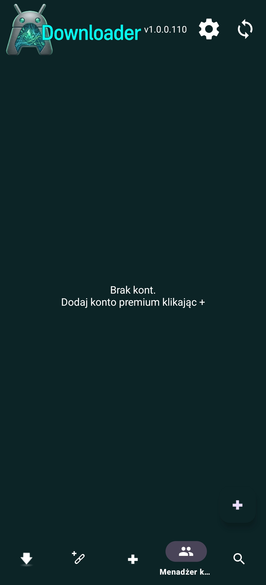
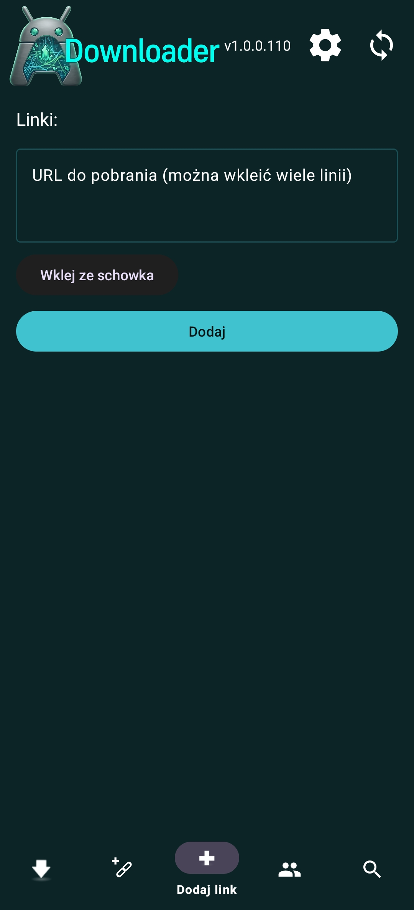
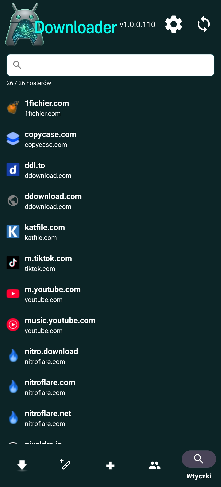

# ADownloader

  
  
  

  
  
  

> **Inspiracja:** ADownloader powstał z inspiracji programem [JDownloader 2](https://jdownloader.org/) –  
> popularnym menedżerem pobierania na PC. Celem było przeniesienie podobnej wygody na Androida.

---

## 📋 Opis

**ADownloader** to aplikacja Android do pobierania filmów i muzyki z serwisu YouTube oraz innych źródeł online.  
Pozwala zarządzać kolejką pobierań, wybierać jakość wideo oraz format audio – wszystko w jednym miejscu.

---

## ✨ Funkcje

| Funkcja | Opis |
|---|---|
| 🎬 Pobieranie z YouTube | Wklej link do filmu i pobierz go w wybranej jakości |
| 📥 Wielokrotne linki | Dodawanie wielu adresów URL naraz (jeden link per linia) |
| 🎞️ Jakość wideo | Najlepsza (4K), 1080p HD, 720p HD, 480p, 360p |
| 🎵 Tylko audio | Pobieranie samej ścieżki dźwiękowej |
| 🎧 Format audio | M4A – bez konwersji (szybko) lub MP3 – konwersja przez FFmpeg |
| ⏸️ Pauza / Zatrzymanie | Pełna kontrola nad trwającymi pobieraniami |
| 📊 Pasek postępu | Podgląd procentu ukończenia i rozmiaru pliku w czasie rzeczywistym |
| 👤 Menadżer kont premium | Obsługa kont premium do pobierania z serwisów wymagających logowania |
| 🔍 Wyszukiwarka | Szybkie przeszukiwanie listy pobierań |
| ⚙️ Ustawienia | Globalne ustawienia jakości i formatu pobierania |

---

## 📸 Zrzuty ekranu

Zrzuty ekranu przedstawiają aplikację w wersji **v1.0.0.110**.  
Jako materiał demonstracyjny użyto publicznego filmu z YouTube:

> **„Alan Walker - Fade Top Darmowa muzyka podkład do filmów i filmików CC BY Electro"**  
> Film jest udostępniony na licencji **Creative Commons Attribution (CC BY)** i może być swobodnie  
> wykorzystywany przy zachowaniu informacji o autorze. Żaden chroniony prawem autorskim materiał  
> nie został pobrany ani rozpowszechniony w ramach tego projektu.

---

## 🚀 Pierwsze kroki

1. Zainstaluj plik APK na urządzeniu z systemem Android.
2. Otwórz aplikację i przejdź do zakładki **„Dodaj link"** (ikona `+` w dolnym pasku nawigacji).
3. Wklej adres URL lub skorzystaj z przycisku **„Wklej ze schowka"**.
4. Kliknij **„Dodaj"**, a następnie skonfiguruj jakość w **Ustawieniach YouTube**.
5. Pobieranie rozpocznie się automatycznie – postęp widoczny jest w zakładce **„Pobieranie"**.

---

## 📱 Nawigacja

| Ikona | Zakładka | Opis |
|---|---|---|
| ⬇️ | Pobieranie | Lista aktywnych i zakończonych pobierań |
| 🖊️ | Dodaj link | Dodawanie pojedynczych lub wielu linków |
| ➕ | Szybkie dodawanie | Skrót do szybkiego wklejenia linku |
| 👥 | Menadżer kont | Zarządzanie kontami premium |
| 🔍 | Szukaj | Przeszukiwanie kolejki pobierań |

---

## 🛠️ Technologie

- **Platforma:** Android
- **Konwersja audio:** FFmpeg (MP3)
- **Obsługiwane źródła:** YouTube i inne serwisy online

---

## 📄 Licencja

Projekt jest dostępny na licencji **MIT** – szczegóły w pliku [LICENSE](LICENSE).  
Copyright © 2026 DriftKing